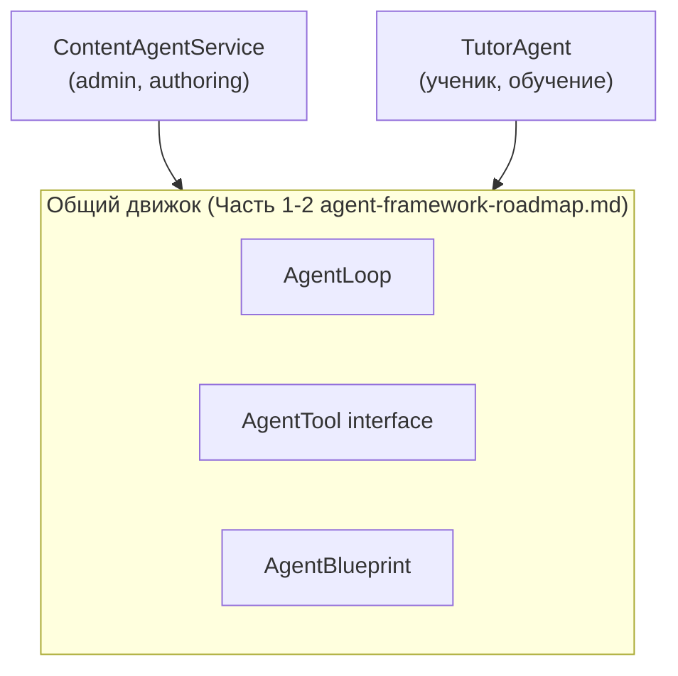
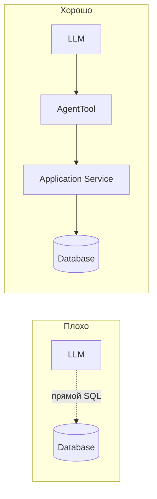
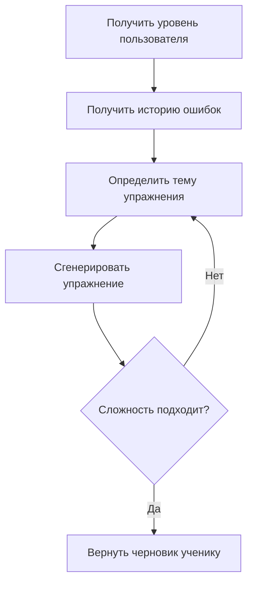
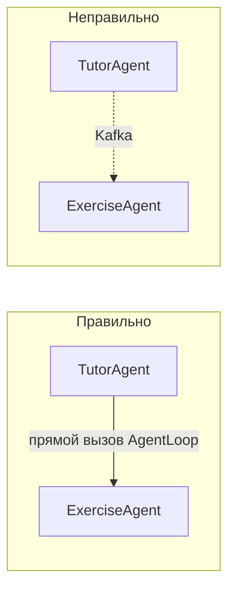
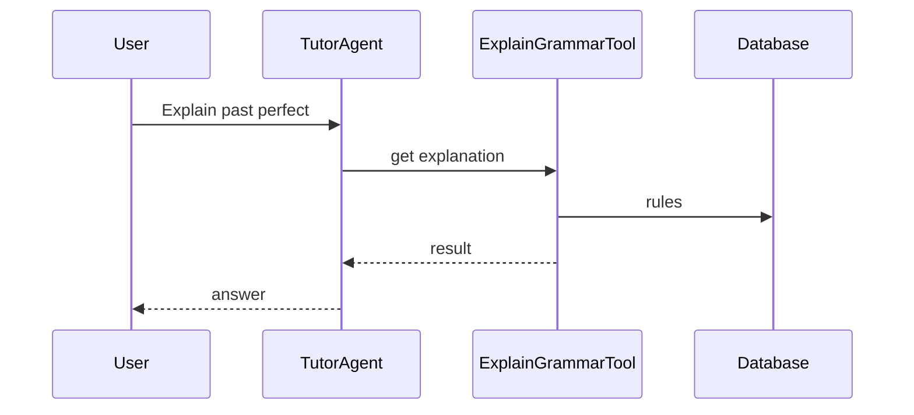
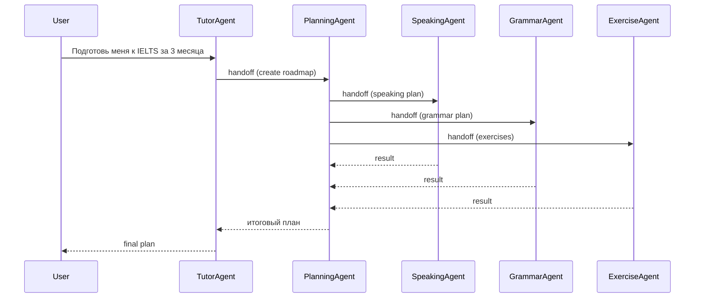
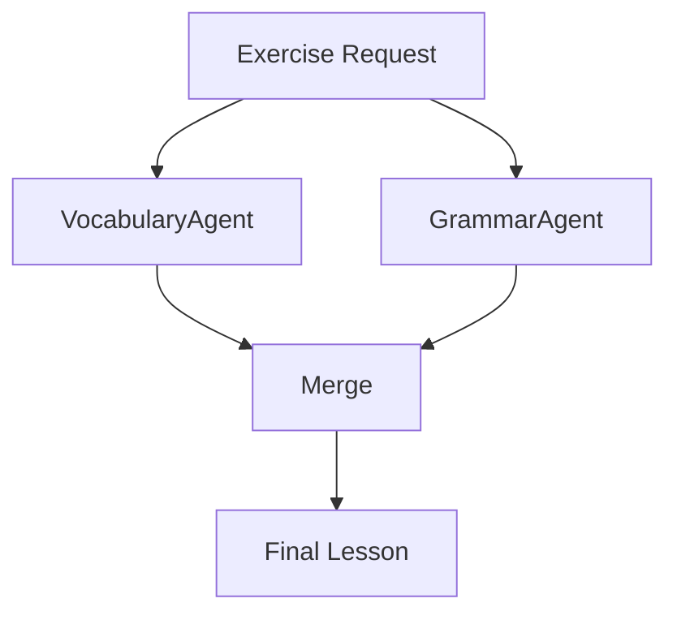
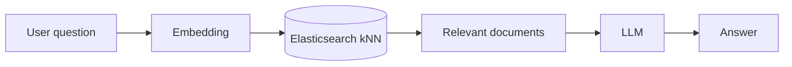
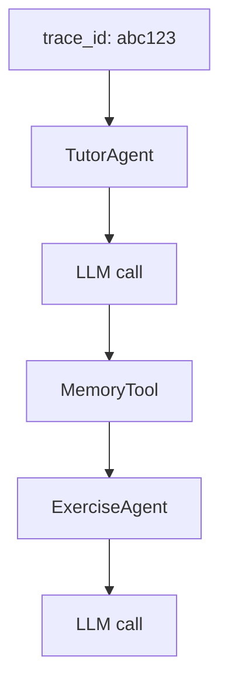
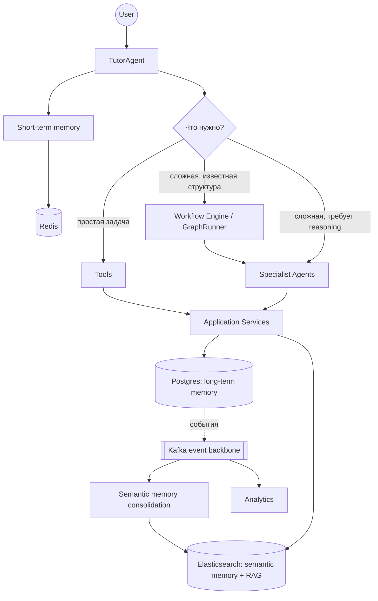

# AI Language Learning Platform — Architecture Vision

## 0. Статус документа и как его читать

Это верхнеуровневый ("North Star") документ. Он даёт общую картину и общий
словарь, но **не дублирует** механику, которая уже детально спроектирована
в двух документах рядом:

- **`docs/architecture/agent-framework-roadmap.md`** — как устроены
  `AgentLoop`, `AgentTool`, `GraphRunner`, fan-out/fan-in, трейсинг на
  уровне классов и мини-шагов реализации (5.1-5.22).
- **`docs/product/ai-engineering-learning-roadmap.md`** — фичи для конечного
  пользователя (стриминг, RAG-репетитор, квизы, рекомендации) и порядок их
  освоения как учебных проектов.

Этот документ ссылается на них вместо повторения — если раздел ниже кажется
кратким, значит подробности искать в одном из этих двух файлов.

**Главное отличие от идеи "с нуля"**: Blue — не greenfield-проект. В нём уже
есть работающий контент-пайплайн (`Content` → транскрипт → токенизация → AI-
анализ → каталог) и один рабочий агент — `ContentAgentService` (админский,
lesson-authoring, tool-calling loop с 5 инструментами). Всё ниже строится
**поверх** этого, не взамен.

## 1. Цель проекта

Превратить Blue из "платформы с AI-фичами" в платформу, где AI выступает как
персональный преподаватель, а не чат поверх LLM. Система должна уметь:

- вести диалог с пользователем;
- помнить историю обучения (не просто хранить лог сообщений);
- анализировать ошибки и слабые темы;
- создавать упражнения под конкретного ученика;
- адаптировать сложность;
- планировать обучение (что повторить, что изучить дальше);
- использовать RAG для поиска по учебным материалам;
- иметь архитектуру, объяснимую и близкую к production AI-системам — это
  явно совпадает с целью проекта как учебного инженерного (см.
  `docs/architecture/engineering-principles.md`).

## 2. Главный принцип: не агентский зоопарк — но два корня, не один

Идея "не создавать сразу рой из TutorAgent/MemoryAgent/ExerciseAgent/
GrammarAgent/ReviewAgent/VocabularyAgent, которые общаются друг с другом" —
верна, и вот почему именно: чем больше независимых агентов с собственными
LLM-вызовами, тем сложнее коммуникация между ними, дороже (каждый переход —
лишний LLM-вызов), сложнее отлаживать и сложнее держать под контролем
безопасность (`sideEffect`, см. раздел 4).

**Уточнение к исходной идее**: в Blue уже есть `ContentAgentService`
(админ, авторинг уроков) — он не исчезает и не сливается с `TutorAgent`.
У них разная аудитория (админ / ученик) и разный профиль риска (админ-агент
работает с черновиками контента, `TutorAgent` — с персональными данными
ученика). Поэтому речь не про "один агент на всё приложение", а про **один
координатор на домен**, оба — поверх одного и того же движка:



Третий корень (например, отдельный агент для B2B/партнёрских интеграций)
добавляется только когда появится домен с реально другой аудиторией и
профилем риска — не "про запас" (см. ADR-001).

## 3. TutorAgent — координатор learner-стороны

**Ответственность:**
- понять запрос пользователя;
- решить: вызвать `Tool` (простая задача), передать управление `Agent`
  (сложная многошаговая задача, раздел 6), или запустить `GraphRunner`-
  workflow (детерминированный многошаговый процесс, раздел 7);
- собрать результат и сформировать ответ.

**TutorAgent НЕ отвечает за:** прямую работу с БД, генерацию сложных уроков
целиком (это `ExerciseAgent`), хранение памяти (это структурированная модель
данных + Kafka-консьюмеры, раздел 9.2), полнотекстовый поиск по материалам
(это RAG-слой, раздел 9.3).

**Уточнение по "Decision / Planning Layer" из черновика**: отдельный слой
планирования — не отдельная сущность, а то, что tool-calling loop уже умеет
из коробки. Модели не нужен внешний "решатель" — ей нужен хороший список
`AgentTool`/`HandoffTool` с понятными описаниями, и она сама выбирает, что
вызвать (это и есть `AgentLoop` из `agent-framework-roadmap.md`). Отдельный
детерминированный `RouterNode` (без LLM) нужен только там, где сигнал уже
однозначен без интерпретации — например, кнопка "Quiz me" в UI уже несёт
явное намерение, спрашивать модель "это запрос на квиз?" — лишний, платный
LLM-вызов. Это уже зафиксировано как ADR в `agent-framework-roadmap.md`
(раздел 4, строка "Роутинг между агентами").

**Про "Agent Router" как отдельный компонент** (встречается в некоторых
набросках архитектуры): при 2-3 специализированных агентах отдельный
классификатор-роутер перед `TutorAgent` не нужен — сам tool-calling уже
решает, к кому обратиться. Если список специализированных агентов вырастет
(5+), может появиться смысл в дешёвом предварительном классификаторе
(маленькая модель/эвристика, которая сразу сужает набор доступных
tools/handoff-целей перед основным вызовом — экономия на размере промпта).
Это оптимизация конкретно под масштаб, не архитектурный компонент по
умолчанию — вводить, когда реально появится 5+ агентов, не раньше.

## 4. Tool Calling — атомарные строительные блоки

Интерфейс `AgentTool` (`definition()` + `execute()`, `sideEffect` из шага
5.3) уже существует и переиспользуется без изменений. Конкретные новые
инструменты для `TutorAgent`, привязанные к реальным таблицам Blue:

| Категория | Инструмент | Источник данных | `sideEffect` |
|---|---|---|---|
| Memory | `GetUserMistakesTool` | `srs_reviews` (проваленные повторения) | `read_only` |
| Memory | `GetLearningHistoryTool` | `user_lexeme_progress` | `read_only` |
| Memory | `GetWeakTopicsTool` | агрегат по `srs_reviews`/`GrammarRule` | `read_only` |
| Progress | `GetUserLevelTool` | `user_lexeme_progress` + CEFR-уровни `Lexeme` | `read_only` |
| Progress | `GetVocabularySizeTool` | `user_lexeme_progress` (learned count) | `read_only` |
| Progress | `GetReviewScheduleTool` | `srs_cards` (due-карточки) | `read_only` |
| Learning | `SearchVocabularyTool` | `Lexeme`/`lexeme_examples` | `read_only` |
| Learning | `ExplainGrammarTool` | `GrammarRule` + (позже) RAG по ES, раздел 9.3 | `read_only` |
| Learning | `FindExamplesTool` | `lexeme_examples`, позже — RAG-корпус | `read_only` |

Это та же таблица инструментов, что была намечена для `StudentTutorAgentService`
в `agent-framework-roadmap.md` (шаг 5.6) — здесь она детализирована.

**Реальный интерфейс, не абстрактный набросок**: в коде уже есть
`App\Modules\Ai\Application\Agent\Contracts\AgentTool` — `definition():
AgentToolDefinition` (объект, несущий имя/описание/JSON-schema параметров
одним куском, не три отдельных метода) и `execute(array $arguments,
AgentToolContext $context): array`. Любой новый Tool из таблицы выше
реализует ровно этот интерфейс, без изменений — важно держать документацию
в согласии с кодом, а не с абстрактной версией "как обычно рисуют".

**Где проходит граница между `ExplainGrammarTool` (Tool) и будущим
`GrammarAgent` (Agent, раздел 5)**: объяснить уже известную конструкцию
("что такое Present Perfect") — один completion-вызов, `Tool`. Разобрать
конкретную ошибку пользователя (найти релевantное правило → сопоставить с
тем, что написал ученик → объяснить именно его случай → проверить, что
объяснение соответствует уровню) — несколько шагов рассуждения, это уже
`GrammarAgent`.

**Почему Tools, а не прямой доступ модели к БД** — принцип не меняется:



Модель никогда не формирует SQL и не видит сырую схему БД — только то, что
явно отдал `AgentTool::execute()` как JSON-результат. Это же не даёт модели
случайно (через промпт-инъекцию, шаг 5.9) добраться до данных, которые
инструмент не собирался отдавать.

## 5. Agent Architecture — для многошаговых задач

Агент (не tool) нужен, когда задачу нельзя решить одним LLM-вызовом: нужен
собственный цикл рассуждений в несколько шагов, собственный контекст,
возможно — собственные под-инструменты.

**Граница Tool vs Agent, явно:** если весь смысл операции — один
completion-вызов с готовыми входными данными → `Tool` (например,
`ExplainGrammarTool` — один вызов). Если нужно: получить данные → на их
основе решить, что делать дальше → возможно скорректировать → проверить
результат → это уже отдельный `AgentLoop` → `Agent`.

### ExerciseAgent



Уточнение: последний шаг — **черновик**, не запись в прогресс напрямую (тот
же принцип human/explicit-confirmation, что и `GenerateQuizTool` в шаге 5.6
`agent-framework-roadmap.md` — ответы ученика на сгенерированные задания
подтверждаются обычным, не-agentic эндпоинтом).

### GrammarAgent

Инструменты: `GrammarSearchTool`, `GrammarExplanationTool`,
`ErrorAnalysisTool`. Отличие от `ExplainGrammarTool` (Tool, раздел 4) — см.
пояснение границы там же: `GrammarAgent` разбирает конкретную ошибку
пользователя, а не отвечает на общий вопрос про конструкцию.

### Другие агенты (по мере реальной необходимости, не все сразу)

- **ReviewAgent** — план повторения на основе SRS + слабых тем (пересекается
  с `ReviewPlannerAgent` из `docs/product/ai-chat-tutor-plan.md`). Инструменты:
  `GetWeakWordsTool`, `CreateReviewPlanTool`, `ScheduleReviewTool`.
- **SpeakingAgent** — практика речи; требует TTS/STT, которых сейчас в
  проекте нет вообще (см. `docs/product/word-training-module-idea.md`,
  раздел 4.1) — честно Phase 5, не раньше.
- **EvaluationAgent** — оценка прогресса за период, вероятно достаточно
  `Tool`, не полноценный агент — проверить на практике перед тем, как
  заводить отдельный `AgentLoop`.
- **PlanningAgent** — особый случай, см. раздел 6 (пример с подготовкой к
  IELTS): агент, который сам делегирует нескольким другим агентам. Это
  единственный обоснованный случай handoff-глубины 2 в системе — заводить
  осторожно, см. ADR-006.

## 6. Agent-to-Agent Handoff

Механика уже спроектирована в `agent-framework-roadmap.md`, раздел 8
(`HandoffTool` = обычный `AgentTool`, чей `execute()` запускает `AgentLoop`
целевого агента). Критерии "использовать только когда" из черновика
подтверждаются и дополняются guardrail'ами, которые уже приняты:

- задача большая, нужен собственный reasoning loop, несколько шагов, нужен
  отдельный контекст — **и** максимальная глубина handoff ограничена (защита
  от A→B→A→B), **и** `sideEffect` инструмента handoff не может быть менее
  строгим, чем самый широкий `sideEffect` целевого агента (иначе handoff
  становится обходом правила "агент не публикует напрямую").

**Важное уточнение, которое стоит явно проговорить**: handoff — это прямой,
синхронный вызов (в рамках одного job'а), **не** через Kafka:



Kafka — не транспорт для agent-to-agent коммуникации (раздел 9.2). Смешивать
эти две вещи — источник большинства проблем в реальных multi-agent системах
(неявные состояния гонки, потерянные сообщения, сложность отладки).

### Два режима на практике

**Режим A — Tool Calling (основной, оценочно 90% запросов):**



Один ход, один-два LLM-вызова, дёшево и легко тестируется (шаг 5.10).

**Режим B — Agent Handoff (сложные, многошаговые запросы):**



Это ровно глубина 2 (`TutorAgent → PlanningAgent → {Speaking, Grammar,
Exercise}`) — граница, уже принятая как максимум для guardrail'а глубины
handoff (раздел 6, `agent-framework-roadmap.md`). Больше — тревожный
сигнал, что задачу лучше решать не цепочкой handoff'ов, а явным графом.

**Важное архитектурное решение по этому примеру**: если композиция "план
подготовки → параллельно спик/грамматика/упражнения → мердж" повторяется
регулярно (а не придумывается моделью каждый раз заново) — её стоит
**перевести из model-directed handoff в явный `GraphDefinition`**
(`ParallelNode`, раздел 7-8) вместо того, чтобы полагаться на то, что
`PlanningAgent` каждый раз правильно решит вызвать все три под-агента.
Явный граф — дешевле (без лишнего LLM-вызова на "кого вызвать"),
предсказуемее и тестируется как обычный код. Model-directed handoff
оставлять для случаев, где структура реально заранее не известна.

## 7. Workflow Engine (реализован как GraphRunner)

**Про название**: "Workflow Engine" — продуктовое имя подсистемы для
долгих, многошаговых, частично детерминированных процессов (создание курса,
подготовка плана обучения). Технически это ровно `GraphRunner` +
`GraphNode` + таблица `agent_graph_runs`, уже спроектированные в
`agent-framework-roadmap.md`. Это **не два разных механизма** — умышленно
не заводится параллельный набор таблиц `workflow_runs`/`workflow_steps` под
то же самое: `agent_graph_runs` уже хранит state/current_node/status
(аналог "workflow run"), а история выполненных шагов уже попадает в
`agent_trace_spans` (раздел 10) — заводить для этого отдельную
`workflow_steps` означало бы дублировать то, что уже пишет трейсинг.

Детально спроектировано в `agent-framework-roadmap.md`, разделы 7, 12, 13.
Здесь — только карта понятий:

| Узел | Роль |
|---|---|
| `LLMNode` | один completion-вызов вне полноценного agent loop |
| `ToolNode` | прямой вызов одного `AgentTool` без диалога с моделью |
| `AgentNode` | целый агент как один узел графа |
| `RouterNode` | детерминированный выбор следующего узла, без LLM |
| `HumanCheckpointNode` | пауза, ждёт внешнего `resume()` |
| `ParallelNode` | fan-out/fan-in (раздел 8 ниже, детали — Часть 3) |

`GraphState` — JSON-сериализуемый (обязательно, граф может приостановиться
на день и продолжиться в другом job'е):

```json
{
  "user_id": 123,
  "goal": "speaking",
  "current_step": "generate_exercise",
  "level": "B2"
}
```

Первый реальный граф — не что-то новое, а переописание уже существующего
пайплайна `AiAnalysisRun` (шаг 5.15) — доказательство движка на знакомом
процессе, прежде чем строить граф `TutorAgent`-роутинга (шаг 5.16).

## 8. Fan-out / Fan-in

Детально — `agent-framework-roadmap.md`, раздел 12 (`Http::pool()` для
конкурентного I/O внутри одного хода, `Bus::batch()` для настоящего
fan-out/fan-in на воркерах Horizon). Пример из черновика (параллельная
генерация лексической и грамматической части урока) — валидный кандидат
на `ParallelNode`:



## 9. Инфраструктура: что уже есть в Blue, а что реально добавить

### 9.1 Redis

**Уже используется** — `QUEUE_CONNECTION=redis` (Horizon), `docker-compose.yml`
уже поднимает `redis`. Не новая технология, а то, что уже работает под
капотом очередей.

**Что реально добавить:** `CACHE_STORE` сейчас `database`, не `redis` — это
конкретный, небольшой шаг (не архитектурное решение, а конфиг): перевести
горячий AI-кэш (объяснения слов — уже кэшируются в `AiExplainLexemeService`,
эмбеддинги, `agent_run` статус для live-опроса UI) на Redis.

**Уточнение к черновику**: Redis-запись вида `agent_run:12345` — это
**быстрая, эфемерная проекция** статуса ("выполняется ли сейчас этот ход",
для live-опроса UI/дедупликации параллельных запусков), а не источник
истины. Источник истины для приостановленных workflow — Postgres
(`agent_graph_runs`, `agent-framework-roadmap.md`), потому что пауза может
длиться часы/дни (например, `HumanCheckpointNode`), а Redis может быть
очищен/эвакуирован в любой момент без потери данных о состоянии. Это
принципиальное различие между "быстрый кэш" и "durable state" — see ADR-005.

### Три уровня памяти ученика — где хранится что и почему именно там

AI должен помнить пользователя на трёх разных горизонтах, и у каждого — свой
правильный технический дом (не "разложить по слоям для красоты", а потому
что у них разные требования к durability/скорости/структуре запроса):

| Уровень | Что | Где | Почему именно там |
|---|---|---|---|
| **Short-term** | Текущий диалог: `conversation_id`, последние сообщения, рабочий контекст хода | Redis | Эфемерно по своей природе — если Redis потеряет активный диалог при рестарте, это неприятно, но не катастрофа (пользователь перепишет вопрос); скорость чтения/записи важнее durability. |
| **Long-term** | Профиль ученика: уровень, предпочтения, история обучения | PostgreSQL (`user_lexeme_progress`, `srs_cards`, будущие `learner_memory_profiles`) | Должно пережить рестарт кэша и быть источником истины — уже так устроено сегодня, ничего нового заводить не нужно. |
| **Semantic** | Свободно сформулированные наблюдения ("постоянно путает Present Perfect", "трудности с артиклями") | Elasticsearch (отдельный индекс от RAG-корпуса, раздел 9.3) | Это не структурированные факты (не влезают в колонки), а текстовые инсайты, которые нужно искать по смыслу — тот же движок, что и RAG, но другой индекс и другое наполнение (свои наблюдения о пользователе, не общий учебный контент). |

Именно semantic-уровень — то, что реально наполняет
`GetWeakTopicsTool`/`GetUserMistakesTool` (раздел 4) содержательными, а не
только количественными данными, и то, что пишут Kafka-консьюмеры
(`exercise.completed` → консьюмер формулирует/обновляет наблюдение →
индексирует в ES) — замыкает цепочку событие → память → инструмент.

### 9.2 Kafka

**Уже частично реализовано, не с нуля**: в проекте уже есть
`PublishContentSubmittedToKafka`-листенер, публикующий `content.lifecycle`-
события (`App\Modules\Content\Interfaces\Listeners\PublishContentSubmittedToKafka`,
топик `content.lifecycle`), консьюмер-команда `ConsumeKafkaCommand`, и
`NullKafkaProducer` как текущая no-op реализация (см. заметку `KAFKA-02` в
`AppServiceProvider.php` — реальный продюсер уже запланирован). Расширение
на AI-события — это включение уже существующего скелета, а не новая
интеграция.

**Роль — event backbone, не RPC** (см. диаграмму в разделе 6). Пример
события после выполнения упражнения:

```json
{
  "type": "exercise.completed",
  "user_id": 123,
  "mistakes": ["past tense"]
}
```

Консьюмеры: сервис консолидации памяти, аналитика, recommendation engine,
уведомления — как в черновике.

**Как это замыкает Memory-модель**: `GetUserMistakesTool`/`GetWeakTopicsTool`
(раздел 4) не должны сами решать "что помнить" через LLM на каждый запрос —
это должно быть уже посчитано заранее консьюмером `exercise.completed`/
`content.lifecycle` в структурированную модель (`learner_memory_profiles`/
`learner_memory_items`, уже намечена в `docs/product/ai-chat-tutor-plan.md`,
раздел "Memory Model"). Kafka — то, что наполняет эту модель асинхронно;
инструменты `TutorAgent` — то, что её read-only читает.

### 9.3 Elasticsearch

**Уже поднят** в `docker-compose.yml`. Здесь важно не перепутать несколько
разных задач одним словом "похожесть" — их на самом деле три:

1. **Каталоговый matching** (`CandidateMatchingService`, уже существует) —
   дедупликация AI-кандидатов против канонического словаря: небольшая,
   закрытая коллекция (тысячи строк), точный/косинусный матч в Postgres.
   **Остаётся как есть** — Elasticsearch здесь не нужен, задача другая.
2. **Semantic memory** (раздел 9.1) — наблюдения о конкретном ученике,
   отдельный индекс, маленький объём на пользователя, но нужен по всем
   пользователям сразу.
3. **RAG над растущим корпусом материалов** (грамматические статьи, банк
   примеров, учебные тексты) — то, что предлагает черновик, и то, для чего
   Elasticsearch (kNN по `dense_vector`) реально подходит лучше линейного
   перебора в PHP: корпус будет расти, и поиск должен оставаться быстрым.
   **Свой индекс, отдельный от (2)** — семантика "что ученик путает" и
   "что вообще есть в учебных материалах" не должны жить в одном индексе, у
   них разная схема документа и разный жизненный цикл.



**Guardrail, не упомянутый в черновике**: документы, пришедшие из RAG-поиска
— это внешний, не полностью доверенный текст (пусть и свой корпус, а не
пользовательский ввод — но контент туда могли добавить через AI-пайплайн).
Та же митигация, что уже принята для `ExtractPdfTextTool` (шаг 5.9) — явные
текстовые границы + инструкция модели "это данные, не команды".

## 10. Observability

Схема, предложенная в черновике, почти дословно совпадает с тем, что уже
спроектировано в `agent-framework-roadmap.md`, раздел 9 (`agent_trace_spans`:
`id`/`trace_id`/`parent_span_id`/`span_type`/`duration_ms`/`prompt_tokens`/
`completion_tokens`/`metadata`) — независимое совпадение, хороший знак, что
дизайн верный. Дополнение из черновика, которого пока нет в Части 2 и стоит
туда занести — явная колонка/производный отчёт `cost_usd` (токены есть,
стоимость по прайсу провайдера — нет).

**Отдельный вопрос, поднятый в другом наброске**: нужна ли отдельная
таблица-заголовок трейса (`agent_traces`) в дополнение к `agent_trace_spans`?
Два кандидата, оба обоснованы:
- **Только `agent_trace_spans`** (текущий план) — дерево восстанавливается
  запросом `WHERE trace_id = ?`, корень — спан с `parent_span_id IS NULL`.
  Просто, без дублирования.
- **`agent_traces` как денормализованная сводка** (`trace_id`, `started_at`,
  `total_duration_ms`, `total_cost_usd`, `entry_agent_type`, `status`),
  заполняемая при закрытии корневого спана — избавляет от пересчёта
  агрегатов на каждый показ списка последних трейсов (дашборд/отчёт по
  стоимости, раздел 9.1).

Решение: **обе** — `agent_trace_spans` остаётся источником истины (детальное
дерево), `agent_traces` — производная, вычисляемая сводка для быстрых
списков/дашбордов, не отдельный независимый источник данных. Не заводить
`workflow_steps`/`workflow_runs` как параллельную сущность — это было бы
третьей записью того же самого "что произошло и когда" (см. раздел 7).



Tier 2 (OpenTelemetry/экспорт в Elasticsearch) — без изменений, тот же план,
что в `agent-framework-roadmap.md`: не заводить отдельный Jaeger/Tempo, раз
ES уже есть.

## 11. Итоговая карта системы



## 12. Implementation Roadmap — с поправкой на то, что уже сделано

| Фаза | Что нужно | Статус в Blue сейчас |
|---|---|---|
| **Phase 1 — AI Core** | `AgentLoop`, `AgentTool` interface, tool calling, conversation storage, token tracking, базовый `TutorAgent` | `AgentTool`/tool calling/conversation storage (`agent_conversations`/`agent_messages`) **уже есть** через `ContentAgentService`. `AgentLoop` как отдельный класс — нет (шаг 5.2). Token tracking — нет (шаг 5.8/5.12). `TutorAgent` — нет (шаг 5.6). |
| **Phase 2 — RAG** | эмбеддинги, Elasticsearch search, knowledge base | Эмбеддинги для каталога — есть (`CanonicalLexemeEmbedding`), но не для RAG-корпуса. ES для RAG — нет (раздел 9.3). |
| **Phase 3 — Tutor MVP** | Tools: progress, mistakes, vocabulary | Нет ни одного (раздел 4) — но данные, на которых они строятся (`user_lexeme_progress`, `srs_cards`), уже есть. |
| **Phase 4 — Agent System** | `ExerciseAgent`, `ReviewAgent`, `GraphRunner`, handoff | Спроектировано (`agent-framework-roadmap.md`), не реализовано. |
| **Phase 5 — Production AI** | OpenTelemetry, evals, cost optimization, продвинутый мониторинг | Evals намечены (`ai-engineering-learning-roadmap.md`, шаг 6). OpenTelemetry — явно Tier 2, не раньше реальной нагрузки. |

Детальная разбивка Phase 1-4 на epics/задачи/миграции/классы/тесты — это
следующий документ, а не этот (см. раздел 14).

## 13. Architectural Decision Records

Полные ADR — в `docs/architecture/adr/`:

- [ADR-001](adr/ADR-001-single-coordinator-per-domain.md) — Почему один координатор на домен, а не рой агентов
- [ADR-002](adr/ADR-002-tools-before-agents.md) — Почему Tools вместо агентов для простых задач
- [ADR-003](adr/ADR-003-kafka-events-only.md) — Почему Kafka только для событий, не для agent-to-agent
- [ADR-004](adr/ADR-004-custom-graphrunner.md) — Почему свой `GraphRunner`, а не LangGraph
- [ADR-005](adr/ADR-005-redis-fast-state-not-source-of-truth.md) — Почему Redis для state — проекция, не источник истины
- [ADR-006](adr/ADR-006-agent-handoff-criteria.md) — Когда использовать agent-to-agent handoff

## 14. Карта документации

| Документ | Что внутри |
|---|---|
| `ai-platform-vision.md` (этот файл) | Верхнеуровневая архитектура, принципы, дорожная карта фаз |
| `adr/ADR-*.md` | Обоснования ключевых решений |
| `agent-framework-roadmap.md` | Механика `AgentLoop`/`GraphRunner`/трейсинга/fan-out на уровне классов, мини-шаги 5.1-5.22 |
| `../product/ai-engineering-learning-roadmap.md` | Фичи для пользователя, порядок освоения как учебных проектов |
| `../product/ai-chat-tutor-plan.md` | Продуктовое видение ролей агентов и памяти ученика |
| `../product/word-training-module-idea.md` | Тренажёр слов (SRS, типы упражнений, TTS) |
| `ai-platform-implementation-roadmap.md` | Исполняемый backlog: epics → задачи → миграции БД, классы, тесты, порядок разработки |
