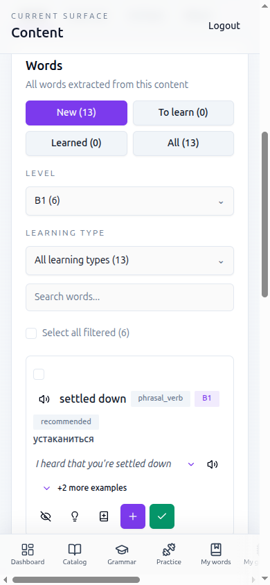
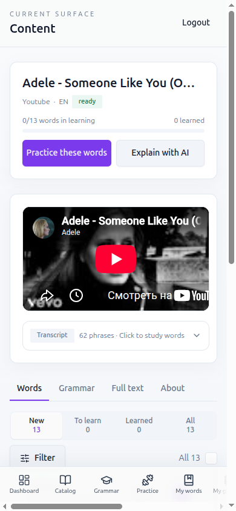
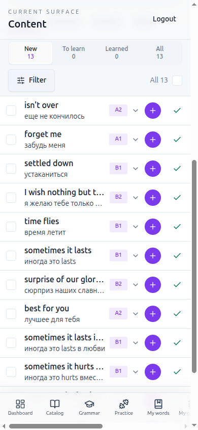

# Страница контента на телефоне: действия, фильтры, список слов (VIK-38)

Короткая дизайн-заметка. Решения уже реализованы в `ContentDetailsPage.vue`,
`StudyPage.vue` и общих `WordListToolbar.vue` / `WordListItem.vue`.

## Проблема (390px, «Adele – Someone Like You»)

- «Start training» и «Ask AI» не говорят, что произойдёт.
- Фильтры занимали ~5 строк: статус 2×2 кнопками, Level select, Learning type
  select, поиск, «Select all filtered».
- Level был предвыбран по уровню профиля (B1) — половина слов скрыта без
  ведома пользователя.
- Карточка слова ~230px: бейджи, пример, 5 иконок; внутри карточки с отступами.
  На экране помещалось ~1 слово после фильтров.

| До: список слов | После: шапка | После: список слов |
|---|---|---|
|  |  |  |

Выбор слов + раскрытая строка: [after-selection-expanded.png](assets/vik-38/after-selection-expanded.png)
(бледность — артефакт page-transition при съёмке в iframe). До, шапка:
[before-header.png](assets/vik-38/before-header.png).

## Что подсмотрели

- **Clozemaster** (`example.jpg`): одна главная кнопка, настройки — в bottom
  sheet, сегменты вместо select'ов, крупные tap targets.
- **LingQ**: список слов — плотные строки на всю ширину, статус слова
  меняется одним тапом справа, детали — по тапу на слово.
- **Anki / Quizlet** списки: строка = термин + перевод, без вложенных
  карточек; массовые действия — в нижней панели при выделении.

## Решения

**Действия.** Одна primary-кнопка **Practice these words** (ведёт на текущую
Practice по этому контенту, позже — на launcher из VIK-30) и secondary
**Explain with AI** (чат с контекстом этого контента). В About та же
формулировка.

**Фильтры — одна строка + сегменты.**

```
┌──────────────────────────────────────┐
│  New   To learn  Learned  (Hidden) All│  ← сегменты, счётчик под подписью
│  13       0         0              13 │
├──────────────────────────────────────┤
│ [⚙ Filter 1]  (B1 ×)        All 13 ☐ │  ← одна строка: фильтр, чипы, выбрать всё
└──────────────────────────────────────┘
```

- Статус остаётся сегментами (это «где я в триаже», а не фильтр), по умолчанию
  New — неразобранные слова. «Not interested» → сегмент **Hidden**, только
  если такие слова есть.
- Level, Learning type и поиск — в bottom sheet **Filter words**; активные
  показываются чипами с × рядом с кнопкой. Ничего не предвыбрано.
- Оставили все три фильтра: level нужен для выбора по силам, type отделяет
  essential/фразы от шума, поиск — для длинных списков. В шторке они не
  стоят места на экране.

**Строка слова — на всю ширину.**

```
┌──────────────────────────────────────┐
│ ☐  settled down            B1  ˅  ⊕ ✓│  56px
│    устаканиться                       │
├──────────────────────────────────────┤
```

- Чекбокс · слово + перевод (truncate) · уровень · ⊕ добавить в обучение
  (− убрать) · ✓ «знаю». Все цели ≥ 44px.
- Тап по слову раскрывает детали: озвучка, тип, категория, грамматика,
  confidence, ассоциации, примеры, Not interested / Explain / More examples /
  Word page.
- На телефоне без внешней карточки: список «вылезает» из отступа страницы,
  строки разделены линиями. От `sm` — снова карточка.

**Мелочи по пути.**

- Скрытые слова везде называются **Hidden** (сегмент, бейдж, кнопка
  «Hide» / «Show again») вместо смеси «Hidden» / «Not interested».
- «Practice in sentences» на странице контента вела в обычную Practice —
  теперь, как на Study, открывает practice-in-context.
- У всех диалогов кнопка × стала 44px (общий `UiDialog`); у `UiButton`
  появились размеры `touch` / `icon-touch` (44px) для экранов ученика.
- В карточке слова под транскриптом детали раскрыты сразу (как было раньше).

**Выбор слов.** При выделении снизу (над нижней навигацией) прилипает панель:
`☐ Select all N · K selected · ×` и `[Add K to learning] [Practice] [⋯]`;
в ⋯ — Practice in sentences и Mark as known (с подтверждением).

## Итог по критериям

- 390px: 10 строк слов на экране, когда список доскроллен до верха (было ~1–3).
  На первом экране сверху шапка, плеер и вкладки — их порядок не менялся
  (плеер/транскрипт вне scope).
- Фильтры в свёрнутом виде — одна строка 44px; level/type/поиск по умолчанию
  пустые. Статус-сегменты — отдельная строка: это триаж, а не фильтр, и
  по умолчанию стоит New (неразобранные слова) — решение PO proxy.
- Горизонтального скролла страницы нет (scrollWidth = clientWidth).
- Цели в строке, фильтрах, чипах и панели — ≥ 44px. Внутри раскрытой строки
  остаются мелкие цели из общих компонентов
  (`SpeakButton` 32px, переключатели примеров в `WordExamples`) — вынесено
  в VIK-43 (shared UI kit).
