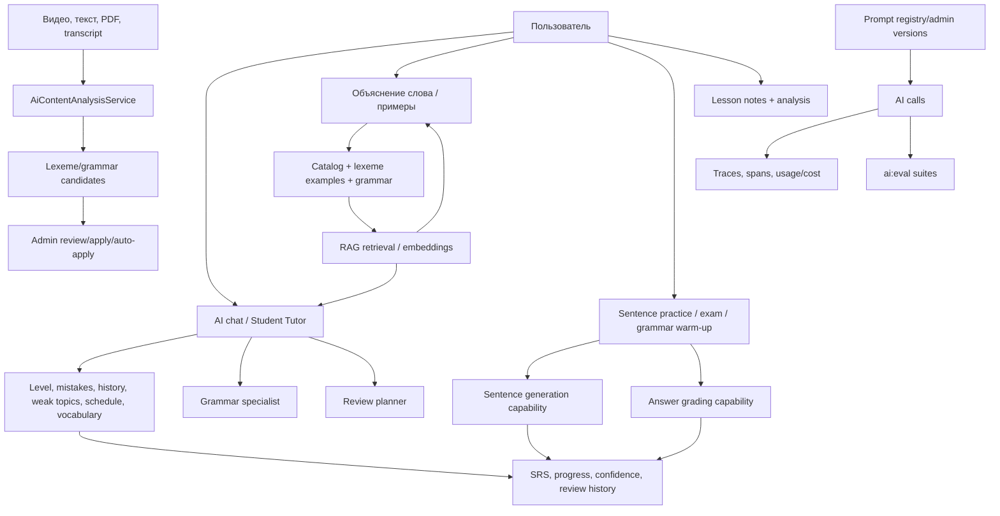

# AI-система Learning App: отдельный исследовательский аудит

Дата: 2026-09-15  
Язык отчёта: русский  
Тип: research-first, code-based audit + evidence review  
Статус: baseline для следующего цикла улучшений

## 1. Цель и границы

Цель аудита — восстановить фактическую AI-архитектуру приложения и проверить, как связаны между собой генерация предложений, примеров, упражнений, объяснений, рекомендации, AI-чат и прогресс ученика. Отдельно оценены качество контроля ответов, безопасность, наблюдаемость и готовность к регулярному самоулучшению.

В отчёте разделены три типа утверждений:

- **Наблюдалось** — проверено через доступный интерфейс или явно видно в текущем коде.
- **По коду** — поведение выведено из реализации, но не подтверждено полным живым сценарием.
- **Нужно измерить** — гипотеза, для которой нужны golden cases, реальные ответы, ручная оценка или продуктовая аналитика.

Полный пользовательский walkthrough ограничен текущим состоянием браузерного теста: удалось проверить оболочку, навигацию, регистрацию и экран AI chat; продолжение было остановлено лимитом браузерного окружения. Поэтому UX-выводы не выдаются за результаты полного end-to-end теста.

## 2. Краткий вывод

Основа сильная: приложение уже имеет модульный AI-слой, provider-neutral capability-контракты, tool-calling агент, read-only/draft-only границы, RAG-поиск примеров, структурированные JSON-ответы, prompt registry, трассировку и отдельную eval-команду.

Главный риск сейчас — не отсутствие AI-функций, а разрыв между количеством возможностей и единым контролем качества. Разные AI-пути используют разные контексты, промпты и критерии успеха. Пользователь может получить полезный текст, но система пока не всегда доказывает, что ответ:

1. относится к конкретной цели ученика и его уровню;
2. фактически использует найденные данные, а не правдоподобно угадывает;
3. педагогически подходит для текущего шага;
4. корректен в примере, переводе, объяснении и оценке свободного ответа;
5. приводит к измеримому действию в обучении.

Приоритет: сначала единый AI quality contract и набор eval-сценариев для каждого режима, затем улучшение персонализации и UX. Новые автономные агенты стоит добавлять после того, как система научится сравнивать версии и безопасно отклонять слабые предложения.

## 3. Карта AI-системы



### Фактические владельцы потоков

| Поток | Владелец | Результат | Запись в live learning state |
|---|---|---|---|
| Анализ контента | `AiContentAnalysisService` | кандидаты слов и грамматики, coverage | через review/apply; AI-анализ сам не должен менять прогресс |
| Объяснение слова | `AiExplainLexemeService` и capability | структурированное объяснение, перевод, примеры/метаданные | обычно read-only, пользователь может перейти в обучение |
| Примеры | `FindExamplesTool` + `RagRetrievalService` | найденные curated examples | read-only |
| Упражнения-предложения | `SentencePracticeService` | карточки с направлением перевода и подсказками | ответ должен идти через обычный SRS flow |
| Проверка свободного ответа | `SentenceAnswerGradingCapability` | correct/feedback/model answer | итог должен фиксироваться через SRS, а не через AI напрямую |
| Ученический агент | `StudentTutorAgentService` + `AgentLoop` | разговорный ответ с tool calls | только чтение и draft quiz; заявленные изменения запрещены |
| Уроки | lesson agent/controller flow | анализ заметок, слова, грамматика, сообщения | анализ урока сохраняется как lesson data |
| Рекомендации | `RecommendationService` | ranked content/lexemes + reasons | read-only предложение следующего шага |

## 4. Как генерируются предложения и примеры

### 4.1. Кандидаты из контента

Цепочка по коду:

1. У контента берётся transcript/source text.
2. Длинный текст разбивается на chunks.
3. `AiContentAnalysisService` получает source language, translation language, target level, исключения и extra instructions из `AiAnalysisRunConfig`.
4. Prompt registry разрешает активную версию промпта; базовый safety/product prompt сохраняется, override добавляется как дополнительные инструкции.
5. AI вызывается через JSON capability со схемой результата.
6. Ответы chunks объединяются и дедуплицируются по тексту lexeme и названию grammar rule.
7. Создаются `ContentLexemeCandidate` и `ContentGrammarCandidate`, рассчитываются coverage и uncovered words.
8. Далее кандидат должен попасть в операционный review/apply-путь; это важная граница human-in-the-loop.

Плюсы: структурированный output, явный язык перевода, CEFR и confidence, обработка длинного текста, повторная попытка при низком coverage, трассировка вызовов.  
Риск: confidence, CEFR и «кандидат действительно встречается в transcript» пока выглядят как поля, которые генерирует модель; нужны независимые deterministic validators и измерение precision/recall по golden transcript.

### 4.2. Примеры для слова

`FindExamplesTool` обращается к `RagRetrievalService`: запрос превращается в embedding и выполняется semantic search по индексу `lexeme_example`. Это уже не обычный `LIKE`, поэтому примеры могут быть семантически близкими и включать несколько связанных lexemes. Это полезно для смысла, но UI и ответ агента должны явно показывать, к какому слову относится каждый пример.

Важное разделение: найденный curated example и AI-generated example — разные классы данных. Первый можно считать retrieved evidence; второй нужно маркировать как generated, проверять на грамматику, естественность, целевое слово, уровень и перевод.

### 4.3. Генерация упражнений-предложений

`SentencePracticeService` собирает контекст из:

- активных SRS-карточек ученика;
- до 10 слов с приоритетом new/relearning и низкой confidence;
- до 5 недавно изучаемых grammar topics;
- native и target language;
- выбранного направления `to_target` или `to_native`.

Для content-scoped режима источником являются слова и грамматика конкретного контента. Exam делится на два однородных вызова: половина карточек в одном направлении, оставшиеся — в другом. Grammar warm-up делает отдельный вызов на правило и детерминированно прикрепляет `grammar_rule_id`.

Это хорошая связь AI с учебным контуром: модель не выбирает произвольные слова, а получает bounded learning frontier. При этом генерация пока stateless и не имеет обязательного post-generation проверки: нельзя считать JSON-valid карточку автоматически педагогически корректной.

### 4.4. Ответ ученика

Свободный ответ отправляется в `SentenceAnswerGradingCapability`. Режим `flexible` допускает семантически эквивалентные переводы, что лучше exact string match для реального языка. Однако модель может ошибиться в трёх направлениях: принять смысловую ошибку, отвергнуть допустимый вариант или дать неуместное объяснение. Поэтому grade должен проходить через confidence/abstain policy и выборочную human review на eval-наборе.

## 5. Какие AI-режимы доступны пользователю

### Уже видно в продукте или явно поддержано кодом

- **AI chat / Tutor chat** — вопросы о словах, ошибках, грамматике, истории обучения и расписании повторений.
- **Context-aware chat** — запуск чата из контента, grammar или слова с привязанным контекстом.
- **Объяснение слова** — из Study/Content details.
- **Примеры для слова** — через vocabulary/RAG-инструмент агента.
- **Grammar explanation** — lookup или handoff к grammar specialist.
- **Draft quiz** — агент может предложить короткий quiz, но не должен сам записывать результат.
- **Review schedule / weak topics / mistakes** — персональные read-only сведения.
- **Personalized multi-day review plan** — handoff к review planner; результат должен быть обозначен как proposal.
- **Sentence practice** — перевод target/native, flexible/exact варианты, typed/tap/reorder и связанные карточки.
- **Content exam / Ready to watch** — mixed-direction проверка слов/грамматики конкретного контента.
- **Lesson analysis** — заметки урока, извлечение слов и grammar.
- **Content re-analysis** — повторный AI extraction для изменённого текста.
- **Recommendations** — content и lexemes, ранжированные по embeddings, overdue reviews, level и learning goal.

### Скрытые или административные AI-режимы

- prompt catalog, template versions и prompt improvement assistant;
- graph definitions, graph runs, nodes, callbacks и human checkpoints;
- RAG indexing/retrieval, semantic cache, embeddings;
- tracing, usage/cost spans и `ai:eval` suites;
- content candidate review/apply и автоматическое применение по порогу.

Главная UX-проблема: пользователь видит набор отдельных поверхностей, а не понятную карту «что сейчас лучше сделать и зачем». Стоит связать каждый AI-режим с одной целью: understand, notice, retrieve, produce, review, reflect.

## 6. Наиболее важные находки

| ID | Статус | Находка и доказательство | Риск | Приоритет |
|---|---|---|---|---|
| AI-001 | По коду | Ученический агент ограничен six iterations, read-only/draft-only; это хорошая граница, но iteration-limit создаёт общий fallback и не классифицирует причину незавершения (`StudentTutorAgentService.php:89-98, 239-246`). | Ответ может выглядеть как обычный «не получилось» без восстановления. | P1 |
| AI-002 | По коду | `get_user_level` оценивает уровень по наиболее частому CEFR среди изученных слов; для нового ученика возвращает `null` (`GetUserLevelTool.php:56-70`). | A2-персона и cold start не имеют надёжного профиля. | P1 |
| AI-003 | По коду | `SentencePracticeService` ограничивает слова и связывает их с SRS/confidence, но генерация делегирована capability без общего validator pipeline. | Неграмматичные, слишком лёгкие, неоднозначные или нецелевые предложения попадут в упражнение. | P1 |
| AI-004 | По коду | `FindExamplesTool` использует semantic retrieval и может смешать близкие lexemes (`FindExamplesTool.php:14-22`). | Объяснение может незаметно опираться на пример другого выражения. | P1 |
| AI-005 | По коду | Eval tutor suite проверяет ожидаемый tool call, а final text/keyword hits не участвуют в pass/fail (`AiEvalCommand.php:188-201`). | Агент может вызвать правильный инструмент и дать плохой или пустой ответ. | P0 |
| AI-006 | По коду | Tutor golden set содержит три сценария; production prompt registry и eval blueprint могут расходиться. | Регрессии в prompt/context остаются невидимыми. | P0 |
| AI-007 | По коду | Content analysis уже сохраняет coverage/confidence и умеет retry, но confidence и CEFR генерирует модель; независимая проверка не видна в этом контуре. | Ложная уверенность в качестве extraction. | P1 |
| AI-008 | По коду | Рекомендации используют bounded pool, embeddings, overdue и level/goal reasons, но новый пользователь без embedding centroid получает почти нулевой semantic signal. | Cold-start рекомендации могут быть слабыми и плохо объяснимыми. | P1 |
| AI-009 | Наблюдалось/по коду | AI chat имеет quick prompts, tool status и context label; в доступном walkthrough не подтверждена вся цепочка запуска из контента/урока. | Пользователь может не понять, какой контекст реально отправлен. | P2 |
| AI-010 | Нужно измерить | Не найдено доказательство product-level связи «AI suggestion → выполненное упражнение → retention/accuracy». | Самоулучшение будет оптимизировать впечатление, а не обучение. | P0 |

## 7. Сопоставление с исследованиями и инженерными практиками

| Область | Что подтверждает литература/практика | Что означает для проекта |
|---|---|---|
| Tool-assisted tutor | Языковые tutoring systems выигрывают от своевременной обратной связи, но feedback должен поддерживать и форму, и смысл. | Для каждой ошибки хранить type, target, correction, explanation и next action; не ограничиваться красивым текстом. |
| RAG | ARES выделяет context relevance, answer faithfulness и answer relevance как разные измерения. | Для `FindExamplesTool` и chat измерять retrieval и generation отдельно; нельзя считать найденный контекст доказательством хорошего ответа. |
| Structured generation | Structured Outputs повышают соответствие JSON-схеме, но схема сама по себе не доказывает фактическую/педагогическую корректность. | Оставить JSON contracts и добавить domain validators, refusal/abstain и schema-version в trace. |
| AI evaluation | Автоматический judge полезен как масштабируемый сигнал, но требует калибровки против human labels. | Использовать rubric + ручную выборку; не делать LLM-as-judge единственным gate. |
| Language learning | Retrieval practice, spaced practice и подходящее распределение повторений поддерживают долговременное обучение; оптимальный интервал зависит от материала и результата. | AI выбирает пример/подсказку/упражнение, а расписание и итоговая память остаются ответственностью SRS и измеренных outcomes. |

Источники:

- Carpenter, Pan, Butler, *The science of effective learning with spacing and retrieval practice*, Nature Reviews Psychology, 2022: https://doi.org/10.1038/s44159-022-00089-1
- ARES, *An Automated Evaluation Framework for Retrieval-Augmented Generation Systems*, 2023: https://arxiv.org/abs/2311.09476
- *Feedback Strategies for Form and Meaning in a Real-life Language Tutoring System*, ACL Workshop, 2018: https://aclanthology.org/W18-7110/
- OpenAI, *Introducing Structured Outputs in the API*, 2024: https://openai.com/index/introducing-structured-outputs-in-the-api/
- Council of Europe CEFR descriptors: https://www.coe.int/en/web/common-european-framework-reference-languages/cefr-descriptors

Вывод из источников: для этого продукта важнее замкнутый контур «контекст → действие → попытка → ошибка → повторение → результат», чем увеличение числа автономных ролей AI.

## 8. Что улучшить: приоритетный backlog

### P0 — сделать качество измеримым

1. Расширить `ai:eval` на suites: `tutor_grounding`, `examples`, `sentence_generation`, `answer_grading`, `content_analysis`, `recommendations`, `safety`.
2. Для каждого кейса сохранять prompt/template version, model, retrieved IDs, tool trace, latency, token/cost и final structured result.
3. Добавить rubric минимум с полями: factuality, grounding, level-fit, pedagogical usefulness, linguistic correctness, safety, actionability.
4. Ввести held-out cases и manual calibration set. Оценивать не только среднее, но и worst-slice: A1/A2, new user, no-data, typo, ambiguity, mixed-language, long transcript.
5. Сделать fail-closed policy: при низкой confidence или конфликте retrieval/answer AI говорит, что не уверен, и предлагает curated lookup или повторную проверку.

Критерий готовности: новая версия prompt/model не может быть promoted, если не прошла обязательные suites и не ухудшила ни один критичный slice сверх заранее заданного порога.

### P1 — единый AI quality contract

Добавить общую post-processing границу для всех capability:

- schema validation;
- target-language and source-grounding checks;
- level/difficulty bounds;
- duplicate and unsafe-content checks;
- required evidence IDs;
- confidence + abstain;
- provenance: retrieved, generated, inferred;
- retry только по классифицированной причине.

Критерий готовности: любой AI-generated example/exercise/feedback имеет provenance, validator result и trace ID; невалидный результат не показывается как готовый учебный материал.

### P1 — улучшить контекст ученика

- Ввести явный learner profile: native language, target language, CEFR estimate с confidence, goals, preferred modes, accessibility.
- Для cold start использовать self-assessment + короткий diagnostic, а не выводить уровень только из частотности learned words.
- Передавать в tutor не только список ошибок, но и dimension: recognition, recall, production, listening, speaking.
- Включать в каждый ответ «почему это предложено» и один следующий шаг.

Критерий готовности: для нового пользователя и пользователя без SRS-истории есть предсказуемые сценарии, а агент не выдумывает уровень или прогресс.

### P1 — примеры и упражнения

- Отделить curated retrieval от generated examples в модели и UI.
- Проверять, что целевое слово/фраза присутствует в sentence в нужной форме.
- Проверять grammar rule, direction, translation language и CEFR range.
- Учитывать recent exposure и не повторять один шаблон без причины.
- После grading сохранять error taxonomy и связывать её с SRS review context.

Критерий готовности: на golden set известны target-word accuracy, grammaticality, translation acceptability, level-fit и false-accept/false-reject rate.

### P2 — сделать AI понятным пользователю

- На каждом AI-результате показывать режим: «объяснение», «пример из каталога», «сгенерированный пример», «план-предложение».
- Добавить компактный блок «использовано»: слово, контент, уровень, ошибки, due reviews.
- Дать feedback actions: «слишком легко», «слишком сложно», «пример плохой», «не понимаю», «полезно».
- Связать ответ с кнопкой действия: Start practice, Add to review, Try another example, Explain simpler.
- Не сообщать ученику, что progress изменён, пока обычный learning/SRS endpoint действительно не записал outcome.

### P2 — рекомендации и автономность

Рекомендатор должен выдавать не только score/reasons, но и recommendation object: objective, expected effort, prerequisite, evidence, expiry, action. Автоматические циклы должны быть ограничены draft proposals и human/quality gate для изменений контента и prompt registry.

### P3 — дополнительные AI-режимы после стабилизации

- адаптивный «Explain simpler / explain in my language / give one contrast»;
- pronunciation coach с отдельным speech-quality contract;
- conversation role-play с контролем уровня и error budget;
- reflection coach после сессии;
- weekly learning report, который связывает AI-предложения с фактически выполненными review и outcomes.

## 9. Рекомендуемый процесс постоянного улучшения

```text
Собрать baseline → запустить eval suites → найти худший slice
        ↓
Проверить trace и retrieved context → создать proposal
        ↓
Изменить prompt/validator/context/UI в отдельном change
        ↓
Прогнать dev + held-out + manual calibration
        ↓
Пилот → проверить learner outcomes → promote или rollback
        ↓
Следующий цикл только по измеримому failure
```

Ежедневный/регулярный audit-agent может собирать findings, но не должен бесконечно менять production. Правильный автономный режим: агент обнаруживает проблему, группирует её по модулю, предлагает change с acceptance criteria, запускает read-only eval и ждёт quality gate. Авто-применение допустимо только для низкорисковых draft/документационных изменений; контент, prompts, scoring и learning logic требуют review.

## 10. Первая очередь OpenSpec/implementation changes

1. **AI evaluation contract and tutor golden set** — расширить кейсы и сделать final answer/grounding/quality частью gate.
2. **Generated learning material validators** — единый validator для examples, sentence cards и translations.
3. **Learner context and cold-start profile** — diagnostic, confidence и явные dimension-aware signals.
4. **AI provenance and feedback UI** — показать источник, режим, причины и следующий шаг.
5. **Outcome telemetry** — связать recommendation/AI response ID с exercise attempt, SRS result и последующим retention signal.

Эти изменения лучше делать по одному bounded change. После первого изменения повторить отдельный AI-аудит с реальными eval-результатами: тогда выводы перейдут из code-based baseline в evidence-based product audit.

## 11. Итоговая оценка

Текущая AI-платформа уже достаточно развита, чтобы перейти от добавления новых агентов к управляемому качеству. Архитектурно сохранены хорошие решения: модульность, ограниченные side effects, структурированные capability, RAG, prompt versioning и traces. Основной долг — единая доказательная система, которая связывает каждый AI-ответ с контекстом, педагогической целью и фактическим результатом обучения.

Рекомендация аудита: первым запускать evaluation contract + validators, вторым — cold-start/learner context, третьим — provenance/action UX. Новые режимы AI добавлять только после появления baseline и promotion gate.
